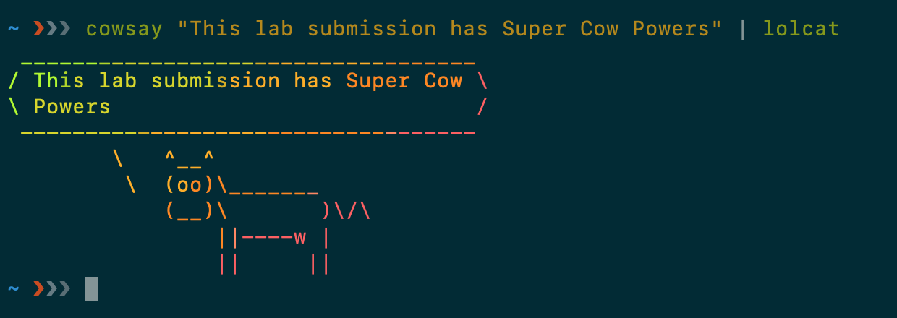

# Lab Report 01 - Leonid Lygin

My machine is hosted on DigitalOcean, and can be reached with a public ip 178.62.254.236 (also using the hostname ionagamed.ru).

`/etc/ssh/sshd_config`:
```c {.line-numbers}
Port 1322
ListenAddress 0.0.0.0
Protocol 2
HostKey /etc/ssh/ssh_host_rsa_key
HostKey /etc/ssh/ssh_host_dsa_key
HostKey /etc/ssh/ssh_host_ecdsa_key
HostKey /etc/ssh/ssh_host_ed25519_key
UsePrivilegeSeparation yes
KeyRegenerationInterval 3600
ServerKeyBits 1024
SyslogFacility AUTH
LogLevel INFO
LoginGraceTime 120
PermitRootLogin yes
StrictModes yes
RSAAuthentication yes
PubkeyAuthentication yes
IgnoreRhosts yes
RhostsRSAAuthentication no
HostbasedAuthentication no
PermitEmptyPasswords no
ChallengeResponseAuthentication no
PasswordAuthentication no
X11Forwarding no
X11DisplayOffset 10
PrintMotd no
PrintLastLog yes
TCPKeepAlive yes
AcceptEnv LANG LC_*
Subsystem sftp /usr/lib/openssh/sftp-server
UsePAM no
GatewayPorts yes
AllowUsers root fatawesome
```

After configuration change (the service is called `ssh` on ubuntu):
```
$ systemctl reload ssh
```

Key generation:
```
$ ssh-keygen -t ed25519 -f ~/.ssh/ionagamed.ru/id_ed25519
Generating public/private ed25519 key pair.
Enter passphrase (empty for no passphrase):
Enter same passphrase again:
Your identification has been saved in /Users/ionagamed/.ssh/ionagamed.ru/id_ed25519.
Your public key has been saved in /Users/ionagamed/.ssh/ionagamed.ru/id_ed25519.pub.
The key fingerprint is:
SHA256:pHr6AfpW2dFyZZaCXcKPfq+e8c/zIhJhIzypD3LkcbY ionagamed@ionagamed-pc-2.local
The key's randomart image is:
+--[ED25519 256]--+
|         +....   |
|        . +.=    |
|       ..o B     |
|      ooX B .    |
|    .o.BSX o     |
|   ..oB E o .    |
|  . .+oo   o..   |
|   ..o .. . .+oo |
|   .o..    o+o.o*|
+----[SHA256]-----+
```

Ed25519 generates shorter keys than RSA, the public key line looks *l33t*:
```
ssh-ed25519 AAAAC3NzaC1lZDI1NTE5AAAAIOKctqwPqV5Ec+c24ZFjsnw1eUWyBL7BFMEAd1jogNul ionagamed@ionagamed-pc-2.local
```

To upload the key:
```
$ ssh-copy-id -i ~/.ssh/ionagamed.ru/id_ed25519.pub ionagamed.ru
```

Checking the `authorized_keys`:
```
$ ssh -i ~/.ssh/ionagamed.ru/id_ed25519 ionagamed.ru
Last login: Tue Aug 27 08:58:27 2019 from 188.130.155.164
root@ubuntu-s-1vcpu-1gb-ams3-01:~# cat ~/.ssh/authorized_keys
ssh-ed25519 AAAAC3NzaC1lZDI1NTE5AAAAIOKctqwPqV5Ec+c24ZFjsnw1eUWyBL7BFMEAd1jogNul ionagamed@ionagamed-pc-2.local
```

To connect without specifying username, port, and other stuff, doing some configuration in `~/.ssh/config`:
```
$ cat ~/.ssh/config | head -n 6
Host ionagamed.ru
    HostName ionagamed.ru
    Port 1322
    User root
    IdentityFile ~/.ssh/ionagamed.ru/id_ed25519

```

The friend's name is `fatawesome` (can be seen in the `AllowUsers` section of the config),
here are the logs of him connecting:
```
$ journalctl -fu ssh
Aug 21 15:40:17 ubuntu-s-1vcpu-1gb-ams3-01 sshd[3567]: Accepted publickey for root from 188.130.155.157 port 57210 ssh2: RSA SHA256:rfaOVHMlyxVOcUBIAgn/7imXApBbQZ0q2/QExyJ//ds
Aug 22 10:15:54 ubuntu-s-1vcpu-1gb-ams3-01 sshd[5550]: Accepted publickey for root from 188.130.155.157 port 52455 ssh2: RSA SHA256:rfaOVHMlyxVOcUBIAgn/7imXApBbQZ0q2/QExyJ//ds
Aug 22 21:17:57 ubuntu-s-1vcpu-1gb-ams3-01 sshd[6313]: Accepted publickey for root from 188.130.155.157 port 60515 ssh2: RSA SHA256:rfaOVHMlyxVOcUBIAgn/7imXApBbQZ0q2/QExyJ//ds
Aug 22 21:18:19 ubuntu-s-1vcpu-1gb-ams3-01 sshd[6329]: Accepted publickey for fatawesome from 188.130.155.157 port 50038 ssh2: RSA SHA256:8v50DArg1I6jWfWjuiT153+ZjnLLf/j8mFxcXPONZe0
```

---


