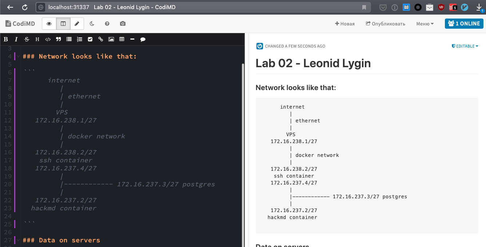

# Lab 02 Report - Leonid Lygin

## GitHub
GitHub repo with all files - https://github.com/ionagamed/sna-labs/tree/master/lab02
* `script.py` - run this on a machine with docker, and it will do all steps from the lab
* `docker-compose.yml` - compose with all required containers
* `example_keypair[.pub]` - example ed25519 keypair for SSH for convenience
* `sshd_config` - config for ssh, which will be mounted into the container
* `postgres-data.zip` - data directory (which is kept as a zip in git, because git doesn't keep empty directories, and `.gitkeep` makes postgres whine about something)

## Outputs and configs

``` {.line-numbers}
root@ubuntu-s-1vcpu-1gb-ams3-01:~/sna-labs/lab02# python3 script.py
--------------------------------------------------------------------------------
$ docker version
Client:
 Version:           18.09.5
 API version:       1.39
 Go version:        go1.10.8
 Git commit:        e8ff056
 Built:             Thu Apr 11 04:44:24 2019
 OS/Arch:           linux/amd64
 Experimental:      false

Server: Docker Engine - Community
 Engine:
  Version:          18.09.5
  API version:      1.39 (minimum version 1.12)
  Go version:       go1.10.8
  Git commit:       e8ff056
  Built:            Thu Apr 11 04:10:53 2019
  OS/Arch:          linux/amd64
  Experimental:     false

--------------------------------------------------------------------------------
$ docker-compose pull
Pulling ssh      ... done
Pulling hackmd   ... done
Pulling postgres ... done

--------------------------------------------------------------------------------
$ docker image ls
REPOSITORY                                            TAG                                        IMAGE ID            CREATED             SIZE
postgres                                              9.6-alpine                                 e9b2db970dc4        12 days ago         37.9MB
postgres                                              10                                         3e016ba4a307        6 months ago        230MB
hackmdio/hackmd                                       1.2.0                                      21cd7ff9128c        11 months ago       1.2GB
rastasheep/ubuntu-sshd                                18.04                                      08f01ce8fd9f        15 months ago       234MB

--------------------------------------------------------------------------------
$ curl https://raw.githubusercontent.com/rastasheep/ubuntu-sshd/master/18.04/Dockerfile
  % Total    % Received % Xferd  Average Speed   Time    Time     Time  Current
                                 Dload  Upload   Total   Spent    Left  Speed
100   485  100   485    0     0   3610      0 --:--:-- --:--:-- --:--:--  3592
FROM       ubuntu:18.04
MAINTAINER Aleksandar Diklic "https://github.com/rastasheep"

RUN apt-get update

RUN apt-get install -y openssh-server
RUN mkdir /var/run/sshd

RUN echo 'root:root' |chpasswd

RUN sed -ri 's/^#?PermitRootLogin\s+.*/PermitRootLogin yes/' /etc/ssh/sshd_config
RUN sed -ri 's/UsePAM yes/#UsePAM yes/g' /etc/ssh/sshd_config

RUN mkdir /root/.ssh

RUN apt-get clean && \
    rm -rf /var/lib/apt/lists/* /tmp/* /var/tmp/*

EXPOSE 22

CMD    ["/usr/sbin/sshd", "-D"]

--------------------------------------------------------------------------------
$ curl https://raw.githubusercontent.com/hackmdio/docker-hackmd/master/debian/Dockerfile
  % Total    % Received % Xferd  Average Speed   Time    Time     Time  Current
                                 Dload  Upload   Total   Spent    Left  Speed
100  2627  100  2627    0     0  19417      0 --:--:-- --:--:-- --:--:-- 19459
FROM node:8.11.4

# Build arguments to change source url, branch or tag
ARG HACKMD_REPOSITORY=https://github.com/hackmdio/hackmd.git
ARG VERSION=master

# Set some default config variables
ENV DEBIAN_FRONTEND noninteractive
ENV DOCKERIZE_VERSION v0.6.1
ENV NODE_ENV=production

RUN wget https://github.com/jwilder/dockerize/releases/download/$DOCKERIZE_VERSION/dockerize-linux-amd64-$DOCKERIZE_VERSION.tar.gz && \
    tar -C /usr/local/bin -xzvf dockerize-linux-amd64-$DOCKERIZE_VERSION.tar.gz && \
    rm dockerize-linux-amd64-$DOCKERIZE_VERSION.tar.gz

ENV GOSU_VERSION 1.10
COPY resources/gosu-gpg.key /tmp/gosu.key
RUN set -ex; \
    dpkgArch="$(dpkg --print-architecture | awk -F- '{ print $NF }')"; \
    wget -O /usr/local/bin/gosu "https://github.com/tianon/gosu/releases/download/$GOSU_VERSION/gosu-$dpkgArch"; \
    wget -O /usr/local/bin/gosu.asc "https://github.com/tianon/gosu/releases/download/$GOSU_VERSION/gosu-$dpkgArch.asc"; \
    \
# verify the signature
    export GNUPGHOME="$(mktemp -d)"; \
    gpg --import /tmp/gosu.key; \
    gpg --batch --verify /usr/local/bin/gosu.asc /usr/local/bin/gosu; \
    rm -rf "$GNUPGHOME" /usr/local/bin/gosu.asc; \
    \
    chmod +x /usr/local/bin/gosu; \
# verify that the binary works
    gosu nobody true

# Add configuraton files
COPY resources/config.json resources/.sequelizerc /files/

RUN apt-get update && \
    apt-get install -y git build-essential && \

    # Clone the source
    git clone --depth 1 --branch $VERSION $HACKMD_REPOSITORY /hackmd && \
    # Print the cloned version and clean up git files
    cd /hackmd && \
    git log --pretty=format:'%ad %h %d' --abbrev-commit --date=short -1 && echo && \
    rm -rf /hackmd/.git && \

    # Symlink configuration files
    rm -f /hackmd/config.json && ln -s /files/config.json /hackmd/config.json && \
    rm -f /hackmd/.sequelizerc && ln -s /files/.sequelizerc /hackmd/.sequelizerc && \

    # Install NPM dependencies and build project
    yarn install --pure-lockfile && \
    yarn install --production=false --pure-lockfile && \
    yarn global add webpack && \
    npm run build && \

    # Clean up this layer
    yarn install && \
    yarn cache clean && \
    apt-get remove -y --auto-remove build-essential && \
    apt-get clean && apt-get purge && rm -r /var/lib/apt/lists/* && \
    # Create hackmd user
    adduser --uid 10000 --home /hackmd/ --disabled-password --system hackmd && \
    chown -R hackmd /hackmd/

WORKDIR /hackmd
EXPOSE 3000

COPY resources/docker-entrypoint.sh /usr/local/bin/docker-entrypoint.sh

ENTRYPOINT ["/usr/local/bin/docker-entrypoint.sh"]

CMD ["node", "app.js"]

--------------------------------------------------------------------------------
$ if [[ ! -e postgres-data ]]; then unzip postgres-data.zip; fi

--------------------------------------------------------------------------------
$ docker-compose -p lygin_sna_lab up -d
Creating network "lygin_sna_lab_br_default" with driver "bridge"
Creating network "lygin_sna_lab_br_internal" with driver "bridge"
Creating lygin_sna_lab_ssh_1      ... done
Creating lygin_sna_lab_hackmd_1   ... done
Creating lygin_sna_lab_postgres_1 ... done

--------------------------------------------------------------------------------
$ docker inspect lygin_sna_lab_br_default
[
    {
        "Name": "lygin_sna_lab_br_default",
        "Id": "99eea23f8b4102dd1d3b315f3c271177595e0975269668c97007e61608db1d10",
        "Created": "2019-09-02T05:03:49.394519117Z",
        "Scope": "local",
        "Driver": "bridge",
        "EnableIPv6": false,
        "IPAM": {
            "Driver": "default",
            "Options": null,
            "Config": [
                {
                    "Subnet": "172.16.238.0/27"
                }
            ]
        },
        "Internal": false,
        "Attachable": true,
        "Ingress": false,
        "ConfigFrom": {
            "Network": ""
        },
        "ConfigOnly": false,
        "Containers": {
            "2faca2607a9e3d53db071dddde9ecd0b518058b6b2479825a99e3c183f1c87d8": {
                "Name": "lygin_sna_lab_ssh_1",
                "EndpointID": "9635ebc1830f2b5369934c3d9190aca790125c191714391e5029293ee92baf21",
                "MacAddress": "02:42:ac:10:ee:02",
                "IPv4Address": "172.16.238.2/27",
                "IPv6Address": ""
            }
        },
        "Options": {},
        "Labels": {
            "com.docker.compose.network": "br_default",
            "com.docker.compose.project": "lygin_sna_lab",
            "com.docker.compose.version": "1.21.2"
        }
    }
]

--------------------------------------------------------------------------------
$ docker inspect lygin_sna_lab_br_internal
[
    {
        "Name": "lygin_sna_lab_br_internal",
        "Id": "e058d117a0088f7b8ebb85ee27f35b7c31b6dbc050fa04498b0138170153f4d4",
        "Created": "2019-09-02T05:03:49.476106957Z",
        "Scope": "local",
        "Driver": "bridge",
        "EnableIPv6": false,
        "IPAM": {
            "Driver": "default",
            "Options": null,
            "Config": [
                {
                    "Subnet": "172.16.237.0/27"
                }
            ]
        },
        "Internal": true,
        "Attachable": true,
        "Ingress": false,
        "ConfigFrom": {
            "Network": ""
        },
        "ConfigOnly": false,
        "Containers": {
            "1da067d6a08fafcbbd1cd04ffddf78b87c2346103d0f6350682b0e826618a0ab": {
                "Name": "lygin_sna_lab_hackmd_1",
                "EndpointID": "a4e79d111dfdd9ad74a9984a6d3e58d4c66575fbfce05954d3154aced45b10ee",
                "MacAddress": "02:42:ac:10:ed:02",
                "IPv4Address": "172.16.237.2/27",
                "IPv6Address": ""
            },
            "2faca2607a9e3d53db071dddde9ecd0b518058b6b2479825a99e3c183f1c87d8": {
                "Name": "lygin_sna_lab_ssh_1",
                "EndpointID": "a49c9b0fd3dd7a075b6a257a13510fee54ede8da8ce08964ecbfd3adda30e8f7",
                "MacAddress": "02:42:ac:10:ed:04",
                "IPv4Address": "172.16.237.4/27",
                "IPv6Address": ""
            },
            "d15c39ddd32f9daf8fcab9697d098478cbd9b62f46063063571a48f40e69bbb5": {
                "Name": "lygin_sna_lab_postgres_1",
                "EndpointID": "e3b30f9edf69af67824587dac59bdf38e85057ea65121d84011be19baddc9a22",
                "MacAddress": "02:42:ac:10:ed:03",
                "IPv4Address": "172.16.237.3/27",
                "IPv6Address": ""
            }
        },
        "Options": {},
        "Labels": {
            "com.docker.compose.network": "br_internal",
            "com.docker.compose.project": "lygin_sna_lab",
            "com.docker.compose.version": "1.21.2"
        }
    }
]

--------------------------------------------------------------------------------
$ docker exec lygin_sna_lab_ssh_1 /bin/bash -c "apt-get update && DEBIAN_FRONTEND=noninteractive apt-get install -yq iproute2 iputils-ping"
debconf: delaying package configuration, since apt-utils is not installed
Get:1 http://archive.ubuntu.com/ubuntu bionic InRelease [242 kB]
Get:2 http://security.ubuntu.com/ubuntu bionic-security InRelease [88.7 kB]
Get:3 http://archive.ubuntu.com/ubuntu bionic-updates InRelease [88.7 kB]
Get:4 http://archive.ubuntu.com/ubuntu bionic-backports InRelease [74.6 kB]
Get:5 http://archive.ubuntu.com/ubuntu bionic/universe Sources [11.5 MB]
Get:6 http://archive.ubuntu.com/ubuntu bionic/multiverse amd64 Packages [186 kB]
Get:7 http://archive.ubuntu.com/ubuntu bionic/restricted amd64 Packages [13.5 kB]
Get:8 http://archive.ubuntu.com/ubuntu bionic/universe amd64 Packages [11.3 MB]
Get:9 http://security.ubuntu.com/ubuntu bionic-security/universe Sources [200 kB]
Get:10 http://security.ubuntu.com/ubuntu bionic-security/multiverse amd64 Packages [4173 B]
Get:11 http://security.ubuntu.com/ubuntu bionic-security/universe amd64 Packages [760 kB]
Get:12 http://archive.ubuntu.com/ubuntu bionic/main amd64 Packages [1344 kB]
Get:13 http://security.ubuntu.com/ubuntu bionic-security/main amd64 Packages [628 kB]
Get:14 http://archive.ubuntu.com/ubuntu bionic-updates/universe Sources [343 kB]
Get:15 http://security.ubuntu.com/ubuntu bionic-security/restricted amd64 Packages [6222 B]
Get:16 http://archive.ubuntu.com/ubuntu bionic-updates/restricted amd64 Packages [16.8 kB]
Get:17 http://archive.ubuntu.com/ubuntu bionic-updates/main amd64 Packages [926 kB]
Get:18 http://archive.ubuntu.com/ubuntu bionic-updates/multiverse amd64 Packages [7216 B]
Get:19 http://archive.ubuntu.com/ubuntu bionic-updates/universe amd64 Packages [1279 kB]
Get:20 http://archive.ubuntu.com/ubuntu bionic-backports/universe amd64 Packages [4212 B]
Get:21 http://archive.ubuntu.com/ubuntu bionic-backports/main amd64 Packages [2496 B]
Fetched 29.1 MB in 6s (4556 kB/s)
Reading package lists...
Reading package lists...
Building dependency tree...
Reading state information...
The following additional packages will be installed:
  libatm1 libcap2-bin libelf1 libmnl0 libpam-cap libxtables12
Suggested packages:
  iproute2-doc
The following NEW packages will be installed:
  iproute2 iputils-ping libatm1 libcap2-bin libelf1 libmnl0 libpam-cap
  libxtables12
0 upgraded, 8 newly installed, 0 to remove and 97 not upgraded.
Need to get 910 kB of archives.
After this operation, 2821 kB of additional disk space will be used.
Get:1 http://archive.ubuntu.com/ubuntu bionic-updates/main amd64 libelf1 amd64 0.170-0.4ubuntu0.1 [44.8 kB]
Get:2 http://archive.ubuntu.com/ubuntu bionic/main amd64 libmnl0 amd64 1.0.4-2 [12.3 kB]
Get:3 http://archive.ubuntu.com/ubuntu bionic/main amd64 iproute2 amd64 4.15.0-2ubuntu1 [721 kB]
Get:4 http://archive.ubuntu.com/ubuntu bionic-updates/main amd64 iputils-ping amd64 3:20161105-1ubuntu3 [54.2 kB]
Get:5 http://archive.ubuntu.com/ubuntu bionic/main amd64 libatm1 amd64 1:2.5.1-2build1 [21.9 kB]
Get:6 http://archive.ubuntu.com/ubuntu bionic/main amd64 libcap2-bin amd64 1:2.25-1.2 [20.6 kB]
Get:7 http://archive.ubuntu.com/ubuntu bionic/main amd64 libpam-cap amd64 1:2.25-1.2 [7268 B]
Get:8 http://archive.ubuntu.com/ubuntu bionic/main amd64 libxtables12 amd64 1.6.1-2ubuntu2 [27.9 kB]
Fetched 910 kB in 0s (3281 kB/s)
Selecting previously unselected package libelf1:amd64.
(Reading database ... 9922 files and directories currently installed.)
Preparing to unpack .../0-libelf1_0.170-0.4ubuntu0.1_amd64.deb ...
Unpacking libelf1:amd64 (0.170-0.4ubuntu0.1) ...
Selecting previously unselected package libmnl0:amd64.
Preparing to unpack .../1-libmnl0_1.0.4-2_amd64.deb ...
Unpacking libmnl0:amd64 (1.0.4-2) ...
Selecting previously unselected package iproute2.
Preparing to unpack .../2-iproute2_4.15.0-2ubuntu1_amd64.deb ...
Unpacking iproute2 (4.15.0-2ubuntu1) ...
Selecting previously unselected package iputils-ping.
Preparing to unpack .../3-iputils-ping_3%3a20161105-1ubuntu3_amd64.deb ...
Unpacking iputils-ping (3:20161105-1ubuntu3) ...
Selecting previously unselected package libatm1:amd64.
Preparing to unpack .../4-libatm1_1%3a2.5.1-2build1_amd64.deb ...
Unpacking libatm1:amd64 (1:2.5.1-2build1) ...
Selecting previously unselected package libcap2-bin.
Preparing to unpack .../5-libcap2-bin_1%3a2.25-1.2_amd64.deb ...
Unpacking libcap2-bin (1:2.25-1.2) ...
Selecting previously unselected package libpam-cap:amd64.
Preparing to unpack .../6-libpam-cap_1%3a2.25-1.2_amd64.deb ...
Unpacking libpam-cap:amd64 (1:2.25-1.2) ...
Selecting previously unselected package libxtables12:amd64.
Preparing to unpack .../7-libxtables12_1.6.1-2ubuntu2_amd64.deb ...
Unpacking libxtables12:amd64 (1.6.1-2ubuntu2) ...
Setting up iputils-ping (3:20161105-1ubuntu3) ...
Setting up libpam-cap:amd64 (1:2.25-1.2) ...
Setting up libcap2-bin (1:2.25-1.2) ...
Setting up libelf1:amd64 (0.170-0.4ubuntu0.1) ...
Processing triggers for libc-bin (2.27-3ubuntu1) ...
Setting up libatm1:amd64 (1:2.5.1-2build1) ...
Setting up libxtables12:amd64 (1.6.1-2ubuntu2) ...
Setting up libmnl0:amd64 (1.0.4-2) ...
Setting up iproute2 (4.15.0-2ubuntu1) ...
Processing triggers for libc-bin (2.27-3ubuntu1) ...

--------------------------------------------------------------------------------
$ docker network create lygin_sna_lab_internet
a6c18705cfb15a29ab14a19b30e4089eff4ef4d9d92afa1fc9e1d6b6f2330f87

--------------------------------------------------------------------------------
$ docker network connect lygin_sna_lab_internet lygin_sna_lab_hackmd_1

--------------------------------------------------------------------------------
$ docker exec lygin_sna_lab_hackmd_1 /bin/bash -c "apt-get update && DEBIAN_FRONTEND=noninteractive apt-get install -yq iproute2 iputils-ping"
Get:1 http://security.debian.org jessie/updates InRelease [44.9 kB]
Ign http://deb.debian.org jessie InRelease
Get:2 http://deb.debian.org jessie-updates InRelease [16.3 kB]
Get:3 http://deb.debian.org jessie Release.gpg [1652 B]
Get:4 http://deb.debian.org jessie Release [77.3 kB]
Get:5 http://security.debian.org jessie/updates/main amd64 Packages [888 kB]
Get:6 http://deb.debian.org jessie-updates/main amd64 Packages [20 B]
Get:7 http://deb.debian.org jessie/main amd64 Packages [9098 kB]
Fetched 10.1 MB in 9s (1055 kB/s)
Reading package lists...
Reading package lists...
Building dependency tree...
Reading state information...
iproute2 is already the newest version.
iputils-ping is already the newest version.
0 upgraded, 0 newly installed, 0 to remove and 119 not upgraded.

--------------------------------------------------------------------------------
$ docker network disconnect lygin_sna_lab_internet lygin_sna_lab_hackmd_1

--------------------------------------------------------------------------------
$ docker network rm lygin_sna_lab_internet
lygin_sna_lab_internet

--------------------------------------------------------------------------------
$ docker exec -it lygin_sna_lab_ssh_1 ip route list
default via 172.16.238.1 dev eth0
172.16.237.0/27 dev eth1 proto kernel scope link src 172.16.237.4
172.16.238.0/27 dev eth0 proto kernel scope link src 172.16.238.2

--------------------------------------------------------------------------------
$ docker exec -it lygin_sna_lab_hackmd_1 ip route list
default via 172.16.237.1 dev eth0
172.16.237.0/27 dev eth0  proto kernel  scope link  src 172.16.237.2

--------------------------------------------------------------------------------
$ docker ps
b'CONTAINER ID        IMAGE                            COMMAND                  CREATED             STATUS              PORTS                                      NAMES\nd15c39ddd32f        postgres:9.6-alpine              "docker-entrypoint.s\xe2\x80\xa6"   44 seconds ago      Up 41 seconds                                                  lygin_sna_lab_postgres_1\n1da067d6a08f        hackmdio/hackmd:1.2.0            "/usr/local/bin/dock\xe2\x80\xa6"   44 seconds ago      Up 42 seconds       3000/tcp                                   lygin_sna_lab_hackmd_1\n2faca2607a9e        rastasheep/ubuntu-sshd:18.04     "/usr/sbin/sshd -D -\xe2\x80\xa6"   44 seconds ago      Up 41 seconds       0.0.0.0:31338->22/tcp                      lygin_sna_lab_ssh_1\ncd887baff6ab        ctfd_ctfd                        "/opt/CTFd/docker-en\xe2\x80\xa6"   5 months ago        Up 11 days          0.0.0.0:32769->8000/tcp                    ctfd_ctfd_1\na37be56a3e5c        jwilder/nginx-proxy              "/app/docker-entrypo\xe2\x80\xa6"   5 months ago        Up 2 days           0.0.0.0:80->80/tcp, 0.0.0.0:443->443/tcp   nginx-proxy\n859f33416eb7        mariadb:10.2                     "docker-entrypoint.s\xe2\x80\xa6"   12 months ago       Up 11 days                                                     ctfd_db_1\n265b80c90672        redis:4                          "docker-entrypoint.s\xe2\x80\xa6"   12 months ago       Up 11 days                                                     ctfd_cache_1\n39e127d04178        telegrammessenger/proxy:latest   "/bin/sh -c \'/bin/ba\xe2\x80\xa6"   15 months ago       Up 11 days          0.0.0.0:1082->443/tcp                      mtproto-telegram-proxy\nc293fc41eebe        telegram-proxy:latest            "./proxy"                15 months ago       Up 11 days          0.0.0.0:1081->1080/tcp                     telegram-proxy\n'
--------------------------------------------------------------------------------
$ docker exec lygin_sna_lab_ssh_1 ping -c 1 hackmd
PING hackmd (172.16.237.2) 56(84) bytes of data.
64 bytes from lygin_sna_lab_hackmd_1.lygin_sna_lab_br_internal (172.16.237.2): icmp_seq=1 ttl=64 time=0.097 ms

--- hackmd ping statistics ---
1 packets transmitted, 1 received, 0% packet loss, time 0ms
rtt min/avg/max/mdev = 0.097/0.097/0.097/0.000 ms

--------------------------------------------------------------------------------
$ docker exec lygin_sna_lab_hackmd_1 /bin/bash -c "ping -c 1 8.8.8.8 || true"
PING 8.8.8.8 (8.8.8.8) 56(84) bytes of data.

--- 8.8.8.8 ping statistics ---
1 packets transmitted, 0 received, 100% packet loss, time 0ms


--------------------------------------------------------------------------------
$ docker exec lygin_sna_lab_ssh_1 /etc/init.d/ssh reload
 * Reloading OpenBSD Secure Shell server's configuration sshd
   ...done.

--------------------------------------------------------------------------------
$ docker cp ./example_keypair.pub lygin_sna_lab_ssh_1:/root/.ssh/authorized_keys

--------------------------------------------------------------------------------
$ docker exec lygin_sna_lab_ssh_1 chmod 400 /root/.ssh/authorized_keys

--------------------------------------------------------------------------------
$ docker exec lygin_sna_lab_ssh_1 chown root:root /root/.ssh/authorized_keys

--------------------------------------------------------------------------------
$ chmod 400 ./example_keypair

================================================================================
$ ssh -L 31337:hackmd:3000 -i ./example_keypair -p 31338 root@localhost
Visit http://localhost:31337 to check out hackmd
Waiting for SSH to close
root@2faca2607a9e:~#
```

## Explanation

IMO, sufficient explanation is provided in the github repo in `script.py`, but here are the steps anyway:
1. Checking docker with `docker version`
2. Pulling all required images with `docker-compose pull`
3. Listing all images `docker image ls`
4. CURL'ing the `Dockerfile`s for these images
5. Unzipping the data directory for postgres
6. Upping all containers with `docker-compose up -d`
7. Inspecting both networks
   * `docker network inspect` would not show the routing table, so
   * Installing required utilities with `apt-get update && apt-get install iproute2 iputils-ping`
   * Showing the routing table (from inside the container) with `ip route list`
8. Showing that the containers are running with `docker ps`
9. Pinging containers back and forth to show that `hackmd` is accessible from `ssh`, and internet is not accessible from `hackmd`
10. SSH from host into the container

Note: these steps were executed on a remote host, and SSH binds ports to 127.0.0.1, therefore another SSH tunnel to the remote server was required, and screenshot is pointing to `localhost`: `$ ssh -L 31337:localhost:31337 ionagamed.ru`

## Extra

Docker images could be made smaller either manually (by removing unnecessary tools such as `ip` which is required only for the lab submission) or externally, by using `alpine` image variants, which are build on top of alpine linux, which is a very small distro (5MB with busybox and kernel)

## Screenshot of browser

