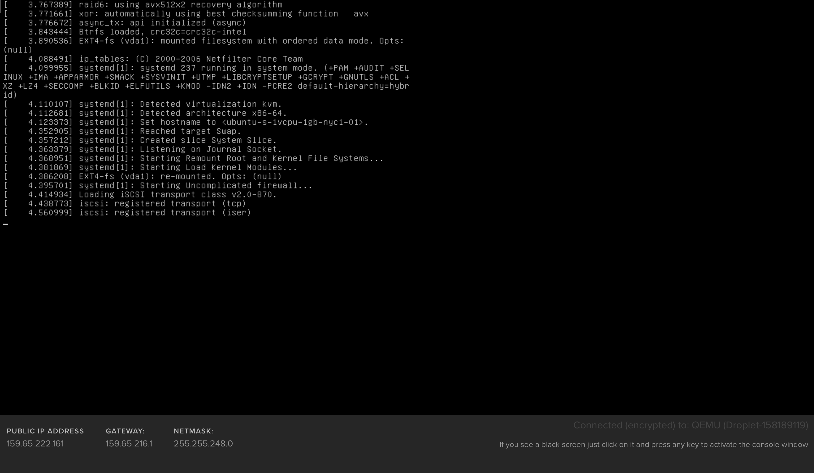
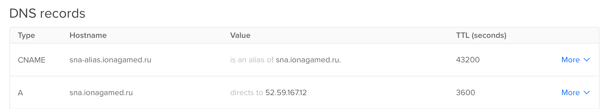

# Lab 03 Report - Leonid Lygin

## Task 1 - Bootloader

Here's a screenshot of boot log with services:



GRUB config changes that were required (not including whole config for brevity):
1. Change `GRUB_TIMEOUT` to `5`
2. Change `GRUB_TIMEOUT_STYLE` to `menu`

## Task 2 - Name resolution

My DNS hosting allows configuration only through a web interface, so here's a screenshot (digitalocean):



Here's a `dig` output for the alias, showing both the `CNAME` and the `A` records:
```
$ dig sna-alias.ionagamed.ru

; <<>> DiG 9.10.6 <<>> sna-alias.ionagamed.ru
;; global options: +cmd
;; Got answer:
;; ->>HEADER<<- opcode: QUERY, status: NOERROR, id: 20271
;; flags: qr rd ra; QUERY: 1, ANSWER: 2, AUTHORITY: 0, ADDITIONAL: 1

;; OPT PSEUDOSECTION:
; EDNS: version: 0, flags:; udp: 4096
;; QUESTION SECTION:
;sna-alias.ionagamed.ru.		IN	A

;; ANSWER SECTION:
sna-alias.ionagamed.ru.	43200	IN	CNAME	sna.ionagamed.ru.
sna.ionagamed.ru.	3596	IN	A	52.59.167.12

;; Query time: 0 msec
;; SERVER: 192.168.1.1#53(192.168.1.1)
;; WHEN: Mon Sep 09 14:10:03 MSK 2019
;; MSG SIZE  rcvd: 85
```

## Task 3 - HTTPD

### 3.1 Application setup
I have chosen to create a simple WebSocket-capable application. It can be found on my github: https://github.com/ionagamed/sna-labs. I have cloned the repo, then copied `./lab03/app` to `/srv`, and then created a systemd unit which would run it. After that systemd needs to reload unit data, and then we can start and enable the service.
``` {.line-numbers}
ubuntu@ip-172-31-40-194:/srv/sna-app$ cat /etc/systemd/system/sna-app.service
[Unit]
Description=SNA websocket application

[Service]
Type=simple
ExecStart=/srv/sna-app/run.py
WorkingDirectory=/srv/sna-app

[Install]
WantedBy=multi-user.target
ubuntu@ip-172-31-40-194:/srv/sna-app$ sudo systemctl daemon-reload
ubuntu@ip-172-31-40-194:/srv/sna-app$ sudo systemctl restart sna-app
ubuntu@ip-172-31-40-194:/srv/sna-app$ sudo systemctl enable sna-app
Created symlink /etc/systemd/system/multi-user.target.wants/sna-app.service → /etc/systemd/system/sna-app.service.
```

### 3.2 Reverse proxy
I have chosen `nginx`. To install, simply use `apt`:
```
$ sudo apt-get install nginx
```

`/etc/nginx/nginx.conf` (after removing some gunk):
``` {.line-numbers}
user www-data;
worker_processes auto;
pid /run/nginx.pid;
include /etc/nginx/modules-enabled/*.conf;

events {
	worker_connections 768;
}

http {
	server {
		listen 443 ssl http2 default_server;
		location / {
			proxy_pass http://localhost:9000;
		}
		location /ws {
			proxy_pass http://localhost:9000;
			proxy_http_version 1.1;
			proxy_set_header Upgrade $http_upgrade;
			proxy_set_header Connection "upgrade";
		}
		ssl_certificate /etc/letsencrypt/live/sna.ionagamed.ru/cert.pem;
		ssl_certificate_key /etc/letsencrypt/live/sna.ionagamed.ru/privkey.pem;
	}

	server {
		listen 80;
		return 301 https://$host$request_uri;
	}

	sendfile on;
	tcp_nopush on;
	tcp_nodelay on;
	keepalive_timeout 65;
	types_hash_max_size 2048;
	include /etc/nginx/mime.types;
	default_type application/octet-stream;
	ssl_protocols TLSv1 TLSv1.1 TLSv1.2; # Dropping SSLv3, ref: POODLE
	ssl_prefer_server_ciphers on;
	access_log /var/log/nginx/access.log;
	error_log /var/log/nginx/error.log;
	gzip on;
}
```

The important lines are 11-29: there we specify two listening ports - 443 for SSL, and 80 for a redirect to SSL. Locations `/` and `/ws` are separate, because `/ws` uses WebSockets and requires additional headers to upgrade the connection.

### 3.3 SSL

Using letsencrypt CA with automatic certificate management from `certbot` (but not automatic configuration management, we have to point nginx to the certificates manually in lines 22-23 of the config).

Installing certbot:
```
$ sudo apt-get install certbot python-certbot-nginx
```

Generating certificates:
```
ubuntu@ip-172-31-40-194:~$ sudo certbot certonly --nginx
Saving debug log to /var/log/letsencrypt/letsencrypt.log
Plugins selected: Authenticator nginx, Installer nginx
No names were found in your configuration files. Please enter in your domain
name(s) (comma and/or space separated)  (Enter 'c' to cancel): sna.ionagamed.ru,sna-alias.ionagamed.ru
Obtaining a new certificate
Performing the following challenges:
http-01 challenge for sna.ionagamed.ru
http-01 challenge for sna-alias.ionagamed.ru
Using default address 80 for authentication.
Using default address 80 for authentication.
Waiting for verification...
Cleaning up challenges

IMPORTANT NOTES:
 - Congratulations! Your certificate and chain have been saved at:
   /etc/letsencrypt/live/sna.ionagamed.ru/fullchain.pem
   Your key file has been saved at:
   /etc/letsencrypt/live/sna.ionagamed.ru/privkey.pem
   Your cert will expire on 2019-12-08. To obtain a new or tweaked
   version of this certificate in the future, simply run certbot
   again. To non-interactively renew *all* of your certificates, run
   "certbot renew"
 - If you like Certbot, please consider supporting our work by:

   Donating to ISRG / Let's Encrypt:   https://letsencrypt.org/donate
   Donating to EFF:                    https://eff.org/donate-le
```

## Task 4 - CROND

My only cron job is updating the forementioned TLS certificates for letsencrypt using certbot.

`/etc/crontab`:
``` {.line-numbers}
SHELL=/bin/sh
PATH=/usr/local/sbin:/usr/local/bin:/sbin:/bin:/usr/sbin:/usr/bin
MAILTO=ionagamed@gmail.com

# m h dom mon dow user	command
0 */12  * * *   root    /usr/bin/certbot -q renew
```
(the comment here is for reference)

Configuring emails:
```
$ apt-get install mailutils sendmail
```

From here, emails will be sent to `MAILTO` from the crontab.

Judging by the logs, STARTTLS is used (`/var/log/mail.log`):
``` {.line-numbers}
Sep  9 11:59:01 ip-172-31-40-194 sm-mta[7421]: x89Bx1iP007421: from=<root@ip-172-31-40-194.eu-central-1.compute.internal>, size=746, class=0, nrcpts=1, msgid=<201909091159.x89Bx1VC007420@ip-172-31-40-194.eu-central-1.compute.internal>, bodytype=7BIT, proto=ESMTP, daemon=MTA-v4, relay=localhost [127.0.0.1]
Sep  9 11:59:01 ip-172-31-40-194 sendmail[7420]: x89Bx1VC007420: to=ionagamed@gmail.com, ctladdr=root (0/0), delay=00:00:00, xdelay=00:00:00, mailer=relay, pri=30396, relay=[127.0.0.1] [127.0.0.1], dsn=2.0.0, stat=Sent (x89Bx1iP007421 Message accepted for delivery)
Sep  9 11:59:01 ip-172-31-40-194 sm-mta[7423]: STARTTLS=client, relay=gmail-smtp-in.l.google.com., version=TLSv1.3, verify=FAIL, cipher=TLS_AES_256_GCM_SHA384, bits=256/256
Sep  9 11:59:01 ip-172-31-40-194 sm-mta[7423]: x89Bx1iP007421: to=<ionagamed@gmail.com>, ctladdr=<root@ip-172-31-40-194.eu-central-1.compute.internal> (0/0), delay=00:00:00, xdelay=00:00:00, mailer=esmtp, pri=120746, relay=gmail-smtp-in.l.google.com. [173.194.76.26], dsn=2.0.0, stat=Sent (OK  1568030341 g8si13213396wrh.408 - gsmtp)
```

## Task 5 - FTPD

At first I wanted to use docker, but network setup with manual NAT turned out to be a hassle, so this is done on two separate machines (shell commands have a "fake" hostname). `m1` would be the "internet" machine, and `m2` would run in the DMZ.

Downloading source:
```
m2$ wget https://security.appspot.com/downloads/vsftpd-3.0.3.tar.gz
m2$ tar xzf vsftpd-3.0.3.tar.gz
```

This package does not use automake, and, subsequently, it is enough to run:
```
m2$ make
m2$ sudo make install
```

Oh, turns out it needs some man directory, let's create it and hope everyting doesn't break:
```
m2$ mkdir -p /usr/local/man/man8
m2$ mkdir -p /usr/local/man/man5
m2$ sudo make install
```

Yeah, it worked.
Let's add a user for ftp:
```
m2$ useradd -m ftp
```
Also a directory for the default `secure_chroot_dir`:
```
m2$ mkdir -p /usr/share/empty
```

Finally, let's run the daemon in the foreground (for testing purposes):
```
m2$ vsftpd
```

Validating that it works:
```
local$ nc <ip> 21
220 (vsFTPd 3.0.3)
```

For the NAT to work with this server configuration, we need to add two rules to the gateway - source NAT and destination NAT, and the first one would be done using iptables' MASQUERADE
```
m1$ iptables -t nat -A PREROUTING -p tcp -m tcp --dport 21 -j DNAT --to-destination 18.197.202.94
m1$ iptables -t nat -A POSTROUTING -p tcp -m tcp --dport 21 -j MASQUERADE
```

And also we need to enable forwaring in the kernel:
```
m1$ echo 1 > /proc/sys/net/ipv4/ip_forward
```

After all that, testing:
```
local$ nc sna.ionagamed.ru 21
220 (vsFTPd 3.0.3)
```

We have got the greeting, hooray.

